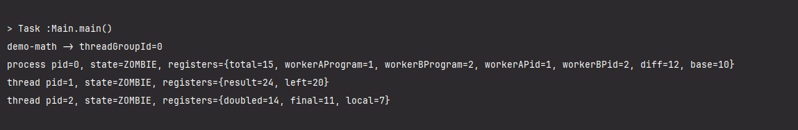

# О ПРОЕКТЕ
## ДЛЯ ЧЕГО
Это прототип учебной виртуальной машины написаной на языке Java. Цель данного проекта - разобраться в том, что такое процессы, и что они из себя представляют на самом деле. Это фундаментальные знания, которые необходимы для точного оснознания того - что такое многопоточность, как делать код потокобезопасным, для чего потоки синхронизируют и какими методами. Вообщем и целом, это необходимо для того, чтобы разобраться в том, что такое асинхронность и почему это круто.

В предыдущем абазаце я употребил словосочетание "для точного осознания" - и это не спроста. Дело в том, что между осознанием и знанием, как по мне, есть принципиальные отличия: знать человек может всё что угодно: что такое инкапусуляция, что такое эндпоинт, что такое виджет в фреймворке и как в нём добавить тень; однако оснознавать человек может не всё что угодно, осознавать - значит понимать принцип работы, осознавать значит понимать фундамент(хотя бы чуть чуть), осознавать значит понимать, почему это тут используется, и не где-то ещё. Человек который осознаёт знание начинает сразу понимать чёткую разницу между этими двумя понятиями. Сейчас было некое лирическое, в котором я хотел попытаться объяснить, чего я хотел добиться написав данный проект.

В данном описании, не будет углубления в теорию, а лишь всё(ну или почти всё(ну или почти почти всё :D )) о том, что вообще из себя представляет данная виртуальная машина

## КЛЮЧЕВЫЕ ПОНЯТИЯ

'Процесс' - это совокупность потоков, которые имеют общее адресное пространство

'Поток' - это отдельная сущность исполнения внутри процесса, которая имеет собственный контекст выполнения.

# СТРУКТУРА ПРОЕКТА

На текущий момент структура проекта выглядит так:

```text
multithreading-emulation/
|-- build.gradle.kts
|-- settings.gradle.kts
|-- gradlew
|-- gradlew.bat
|-- README.md
`-- src
    |-- main
    |   |-- java
    |   |   `-- emulation
    |   |       `-- multithreading
    |   |           |-- Main.java
    |   |           |-- Machine
    |   |           |   |-- ExecutionResult.java
    |   |           |   |-- Interpreter.java
    |   |           |   `-- VirtualMachine.java
    |   |           |-- Managment
    |   |           |   `-- Scheduler.java
    |   |           |-- Memory
    |   |           |   |-- Core
    |   |           |   |   |-- Heap.java
    |   |           |   |   |-- Segment.java
    |   |           |   |   |-- SegmentBuilder.java
    |   |           |   |   `-- SegmentReader.java
    |   |           |   `-- TransferObjects
    |   |           |       `-- SegmentInfo.java
    |   |           `-- Tasks
    |   |               |-- Core
    |   |               |   |-- TaskState.java
    |   |               |   `-- TaskStruct.java
    |   |               `-- TransferObjects
    |   |                   `-- TaskContext.java
    |   `-- resources
    |       `-- programs
    |           |-- demo-math.dinka
    |           |-- demo-secondary.dinka
    |           `-- demo-tertiary.dinka
    `-- test
        |-- java
        `-- resources
```

Что за что отвечает:

- `Main.java` - точка входа. Здесь создаётся виртуальная машина, загружается программа и запускается исполнение.
- `Machine/` - ядро виртуальной машины: сама VM, интерпретатор инструкций и результаты исполнения отдельных шагов.
- `Managment/Scheduler.java` - планировщик задач. Он решает, какая задача будет исполняться следующей.
- `Memory/Core/` - модель памяти: куча, сегменты, а также инструменты чтения и записи в сегменты.
- `Memory/TransferObjects/` - вспомогательные структуры для передачи данных, связанных с памятью.
- `Tasks/Core/` - описание задачи: её состояние, регистры, указатель инструкции, принадлежность к процессу или потоку.
- `Tasks/TransferObjects/` - объекты для сохранения и восстановления контекста задачи.
- `resources/programs/` - набор `.dinka`-программ, на которых можно прогонять и проверять VM.
- `src/test/` - директории под тесты; сейчас это задел на будущее развитие проекта.


# А ТЕПЕРЬ ЧУТЬ ПОПОДРОБНЕЕ ОБ ОСНОВНЫХ КОМПОНЕНТАХ ПРОЕКТА

## ПРОЦЕССЫ И ПОТОКИ

Модель вдохновлена Linux: поэтому и процессы, и потоки - всё есть TaskStruct.

Поля класса TaskStruct:
- pid - уникальный идентификатор "потока";
- threadGroupId - идентификатор позволяющий объединять экземпляры структры в процесс;
- code - набор инструкций для исполнения;
- virtualRuntime - сколько виртуального процессорного времени получила задача.
- instructonPointer - указатель на конкретную интсрукцию, на которой прервалось испролнение;
- memory - динамическая память;
- registers - хэш-таблица, в которой хранятся локальные переменные;
- taskState - текущее состояние системы;


Все TaskStruct можно классифицировать между собой на процессы и потоки по полю threadGroupId. Каждый экземпляр данного класса фактически представляет из себя отдельный пототок. Среди всех потоков процесса можно выделить поток лидер(его pid = threadGroup Id), который является самым главным и который делится с другими потоками процесса адресным пространством.
Только лидер группы может создавать новые объекты - так называемые сегменты в динамической памяти. Однако read / write операции может осуществлять любой из потоков процесса.

## ПАМЯТЬ

Модель памяти вдохновлена cтруктурой данных Cell в блокчейне Ton. TaskStruct содержит указатель на экземпляр класса Heap, который представляет из себя имитацию адресного пространства. Heap содержит внутри себя карту выделенных сегментов памяти. Каждый сегмент имеет стартовый адрес, размер, владельца, имя и набор битов, в которых хранятся данные. За счёт этого Heap работает как простая имитация адресного пространства процесса: он выделяет новые сегменты, освобождает их и позволяет найти нужный сегмент по адресу. 

Сами данные хранятся внутри Segment в виде BitSet. Для записи используется SegmentBuilder, который побитово записывает значения в сегмент, а для чтения используется SegmentReader, который так же побитово считывает данные из сегмента.

Адрес сегмента задаётся его стартовым адресом `startAddress`, а размер сегмента определяет диапазон адресов, которые входят в этот сегмент. Если объяснять это высказывание языком математики я бы сделал это при помощи отрезков: [ startAddress; startAddress + Segment.size )


## ПЛАНИРОВЩИК ЗАДАЧ

Scheduler представляет из очень упрощённую модель планировщика, тем не менее с главной задачей - распределение процессорного времени между потоками разных процессов - он справляется на ура. Ключевым полем данного класса является runQueue - это сердце планировщика. RunQueue содержит в себе ссылку на объект класса PriorityQueue из стандартного пакета java.util, в данной очереди находятся потоки, которые находятся в активном состоянии и готовы к исполнению. Приоритет выдаётся тем потокам, `virtualRuntime` которых минимально. Адрес TaskStruct`а, который планировщик "приговорил :O" к исполнению, помещается в поле currentTask.
Переключение между задачами происходит при вызове метода schedule(). Он сохраняет состояние текущей задачи обратно в runQueue (если она всё ещё готова к работе) и выбирает новую задачу с наименьшим `virtualRuntime`. Планировщик напрямую управляет жизненным циклом потоков через методы blockCurrent() и terminateCurrent(), что позволяет имитировать реальное поведение ОС при ожидании ввода-вывода или завершении процесса.


## ВИРТУАЛЬНАЯ МАШИНА

VirtualMachine — это «кокон» всей системы, высшая инстанция, которая связывает воедино память, планировщик и интерпретатор. Если Heap — это тело, а Scheduler — сердце, то VirtualMachine — это сам организм. Она эмулирует поведение полноценной операционной системы: от загрузки файлов с диска до управления жизненным циклом процессов через PID. Виртуальная машина занимается инициализацией всей системы, а также является главным циклом всего проекта, который дирижирует объектами.Помимо роли дирижёра, VirtualMachine берёт на себя всю работу по управлению ресурсами: она сканирует директории, парсит файлы программ и регистрирует их в системе. Через механизм создания потоков машина позволяет процессам динамически порождать новые задачи, обеспечивая их необходимым контекстом и местом в очереди планировщика. По сути, VM — это единственный объект, который знает о существовании всех компонентов одновременно, заставляя их работать как единый слаженный механизм. Фактически его можно назвать вершиной айсберга.

## ИНТЕРПРЕТАТОР

Интерпретатор - это мозг системы. Именно он вдыхает жизнь в статичные строки кода, превращая их в реальные манипуляции над регистрами и памятью. Он работает в тесной связке с SegmentReader и SegmentBuilder, выступая в роли посредника между высокоуровневой логикой и побитовым хаосом внутри сегментов. Язык который воспринимает интрепретатор имеет расширенеи .dinka, все программы на этом языке находятся в директории resources, из этой директории программы подгружаются и превращаются в процессы благодаря виртуальной машине.

Инстукции интерпретатора:

| Команда | Операнды | Результат (Логика) |
| :--- | :--- | :--- |
| **save** | `n, v` | Записывает значение `v` в регистр с именем `n`. |
| **sum** | `c, a, b` | Складывает `a` и `b`, результат сохраняет в регистр `c`. |
| **minus** | `c, a, b` | Вычитает `b` из `a` (результат `a - b`), сохраняет в регистр `c`. |
| **get** | `n` | Получает текущее значение из регистра `n`. |
| **start** | `a` | Инициализирует `SegmentBuilder` для записи данных по адресу `a`. |
| **parse** | `a` | Инициализирует `SegmentReader` для чтения данных по адресу `a`. |
| **rvalue** | `r, s` | Считывает `s` бит из памяти в регистр `r` (через `reader`). |
| **wvalue** | `s, v` | Записывает значение `v` размером `s` бит в память (через `builder`). |
| **nthread** | `c, p, l` | Создает новый поток из программы `p` со строки `l`. PID -> в регистр `c`. |
| **yield** | — | Добровольная передача кванта времени другому потоку. |
| **block** | — | Переводит текущий поток в состояние блокировки. |
| **terminate** | — | Немедленное завершение работы текущего потока. |
 

Пример кода .dinka:

demo-math.dinka - program 0
```
save workerAProgram 1
save workerBProgram 2
nthread workerAPid workerAProgram 0
nthread workerBPid workerBProgram 0
save base 10
yield
sum total base 5
minus diff total 3
terminate
```

demo-secondary.dinka - program 1 ( Данный код будет выполняться в потоке workerAPid из demo-math.dinka)
```
# Worker thread A
save left 20
yield
sum result left 4
terminate
```


demo-teriary.dinka - program 1 ( Данный код будет выполняться в потоке workerBPid из demo-teriary.dinka)
```
# Worker thread B
save local 7
yield
sum doubled local local
minus final doubled 3
terminate

```

# ПРИМЕР РАБОТЫ

```java
public class Main {
    public static void main(String[] args) {
        VirtualMachine virtualMachine = new VirtualMachine();
        virtualMachine.init();

        int processId = virtualMachine.createProcessFromProgram("demo-math", 65536);

        virtualMachine.run();

        printThreadGroupResult(virtualMachine, processId, "demo-math");
    }

    private static void printThreadGroupResult(VirtualMachine virtualMachine, int threadGroupId, String programName) {
        System.out.println(programName + " -> threadGroupId=" + threadGroupId);

        for (TaskStruct task : virtualMachine.getTasksByThreadGroupId(threadGroupId)) {
            String taskKind = task.isProcess() ? "process" : "thread";
            System.out.println(
                    taskKind
                            + " pid="
                            + task.getPid()
                            + ", state="
                            + task.getTaskState()
                            + ", registers="
                            + task.getRegisters()
            );
        }

        if (virtualMachine.getTasksByThreadGroupId(threadGroupId).isEmpty()) {
            System.out.println("No tasks found for thread group: " + threadGroupId);
            return;
        }
    }
}
```

Результат работы:



## ИТОГИ

Более абстрактное описание проекта, и при этом более теоретически углубленное описание в течение двух месяцев(я надеюсь) появится на habr`е. Ссылка на статю -> [тут будет ссылка на статью]. Данная реализация не является потокобезопасной, и фактически возможность создавать потоки добавлена исключительно ради многопоточности, но при этом без асинхронности. Возможно в будущем доработаю и добавлю потокобезопасноть - это было бы следующим крепким шагом на пути к осознанию. 

Очень жаль, что эти знания мало кем ценятся. Особенно в эпоху нейросетей. Нейросети это очень мощный инструмент позволящий крайне быстро учиться чему-то новому, причём уровень обучние встаёт на радикально иной уровень, более качественный. Не позволяйте нейросетям поставить Вас на ступень эволюции ниже, чем они.